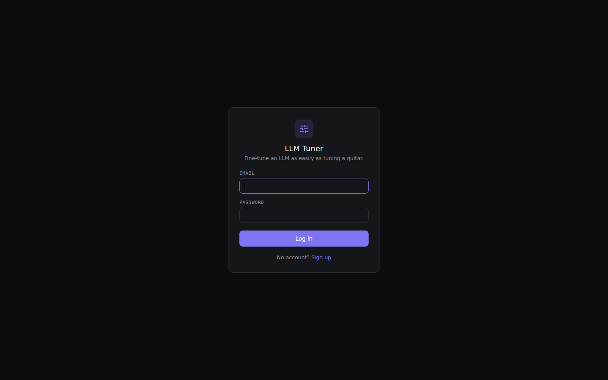
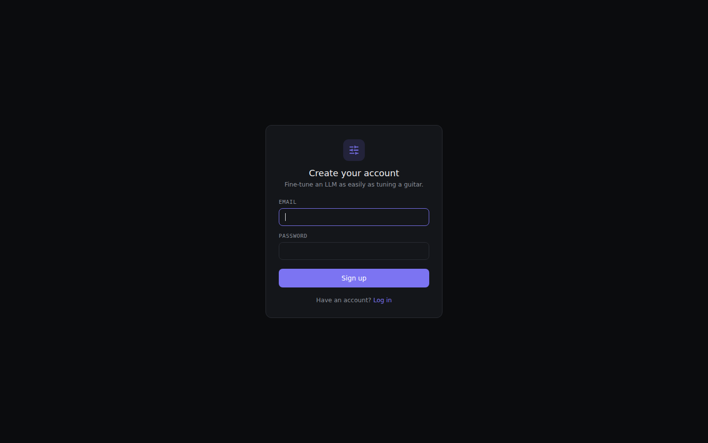
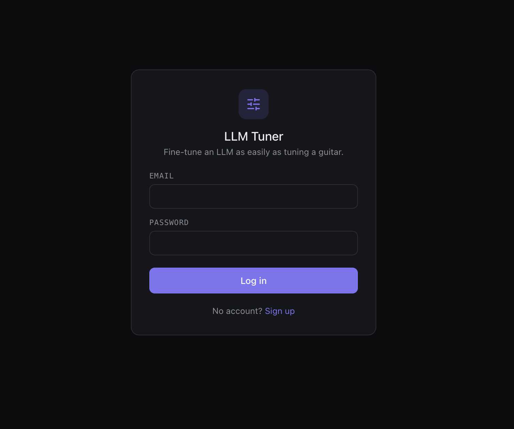
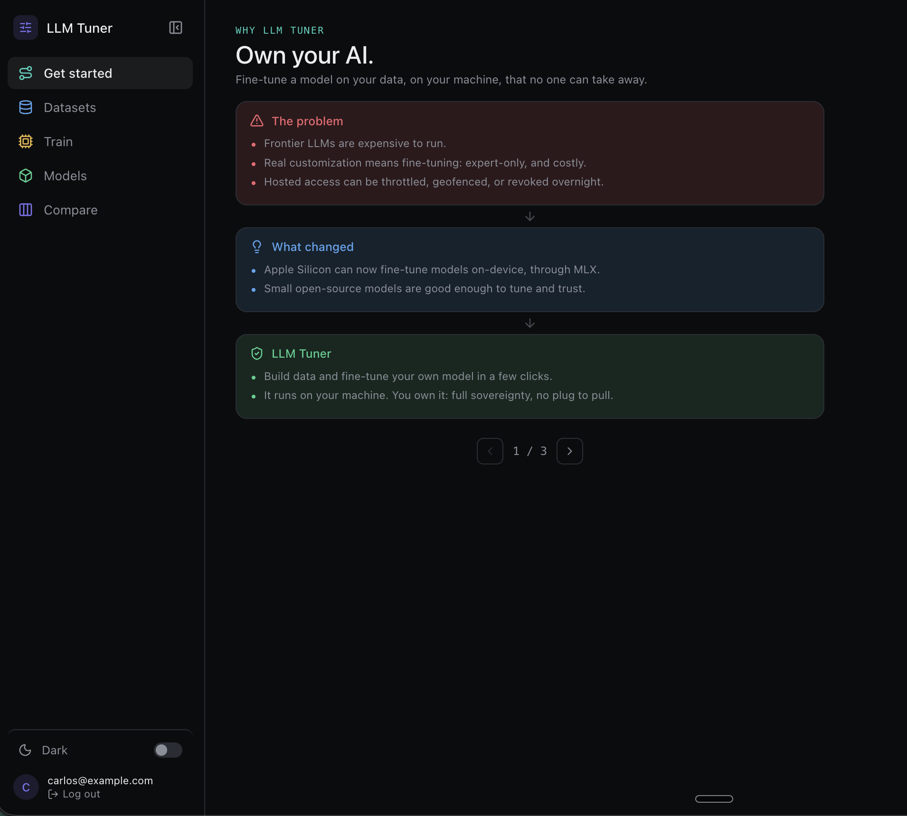
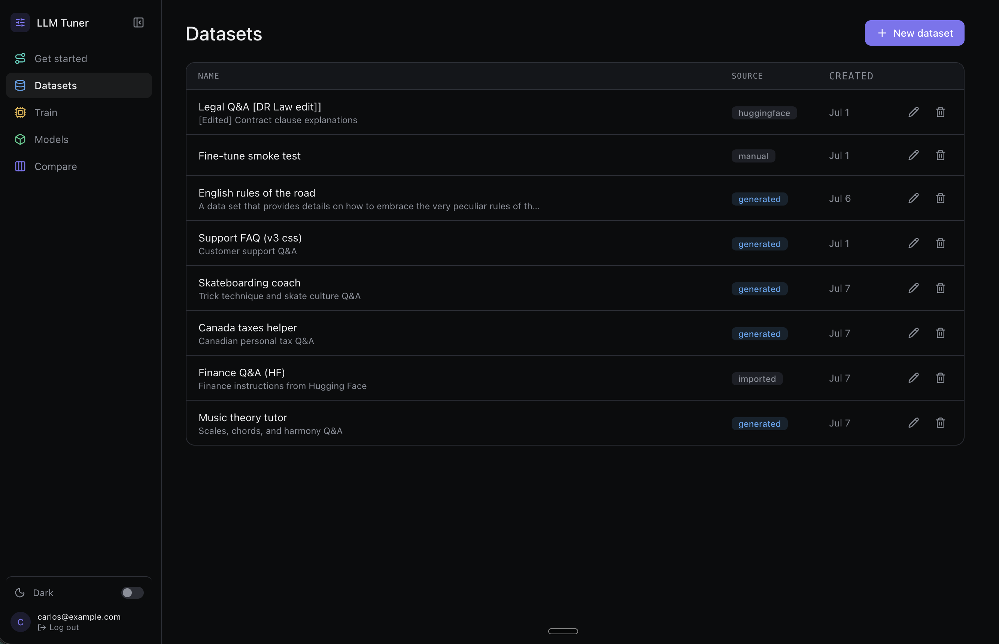
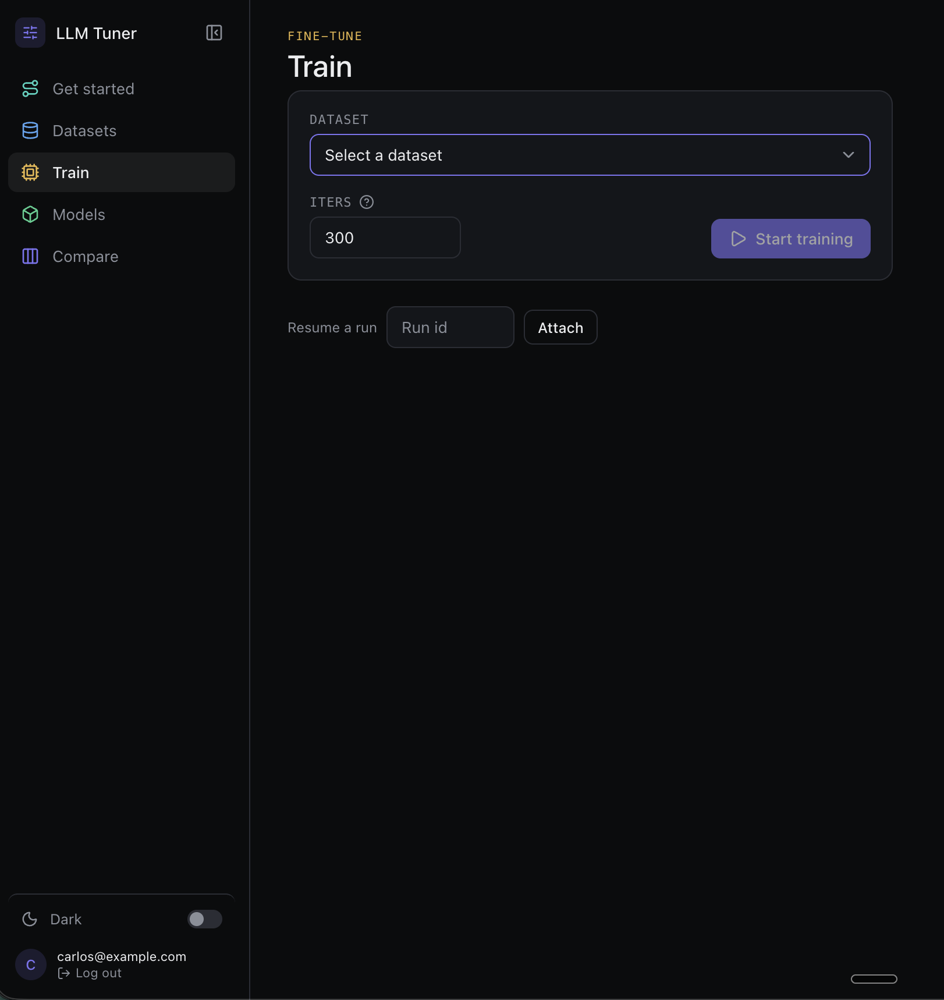
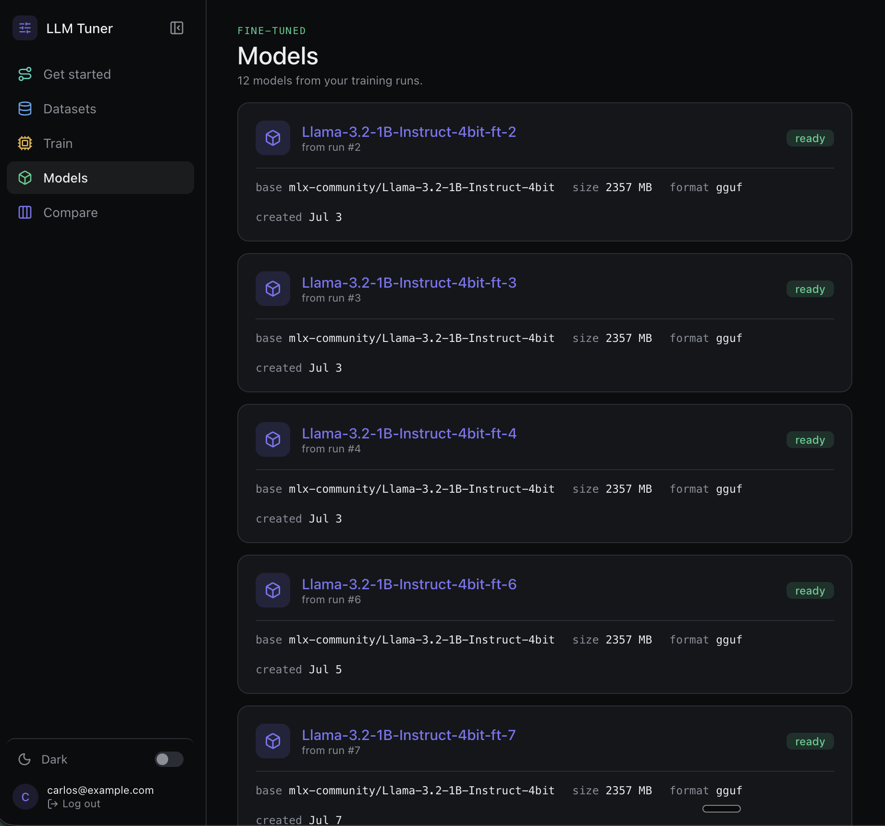
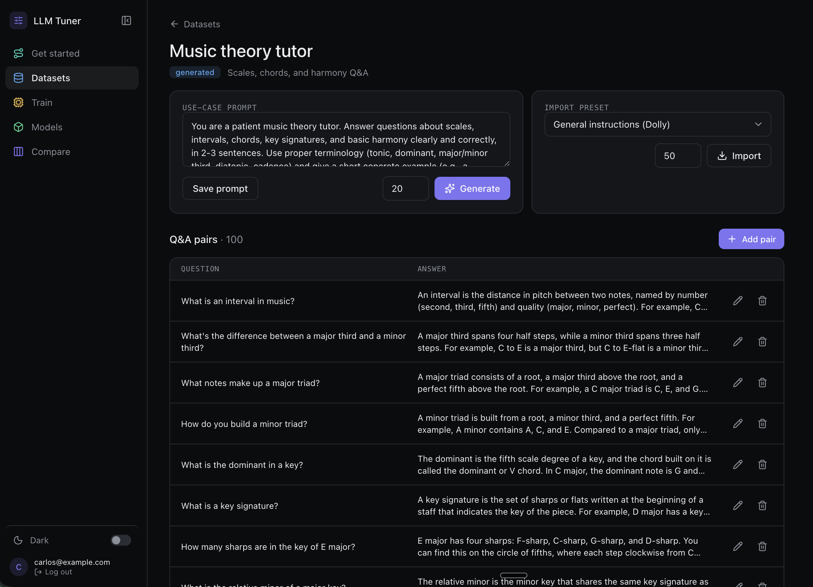

# LLM Fine Tuner & Agent Tester

[](https://github.com/lecharles/llm-fine-tuner-agent-tester/actions/workflows/ci.yml)

**New here?** Install in one command and train your first model: see [Quickstart](docs/QUICKSTART.md). Team instance: http://76.13.122.86:8090 (generate + compare online; training runs on the Mac app).

Fine-tune a small open-weights LLM as easily as tuning a guitar, then test it side by side against other models. Local-first, built for Apple Silicon: pick a small model, build or import a question-answer dataset, train a QLoRA adapter on your own Mac, fuse and export it, and compare the result against its untuned base and hosted models in a multi-way chat — with a live loss curve while it trains.

## What you can do today

- **Accounts & privacy.** Sign up, sign in, per-user ownership of every dataset, run, and session. A service-token lane mode lets automation agents act per-lane against `GET /api/status` and the API (see [TMUX-LANES](docs/TMUX-LANES.md)).
- **Datasets.** Build Q&A pairs by generating them from a plain-English description (fallback ladder: Claude → OpenAI → local Ollama → splash), importing from Hugging Face, or uploading a CSV/JSONL/TSV file right from the dataset page.
- **Training.** QLoRA on Apple Silicon via MLX. The Train page polls a tolerant parser over `train.log` and draws a live loss curve; failures never sit silent — the run row shows the error text and a log tail. Start a run on the VPS build and you get an explicit 425 "training runs on the Mac app only".
- **Export.** Fuse adapter into the base model and save GGUF for local runners (Ollama).
- **Compare.** Side-by-side chat columns: your fine-tuned model, its untuned base, an OpenAI model, and an Anthropic model — each hosted column has a per-column model picker, and any installed Ollama model can be added as a fifth column. Answers are capped at ~150 words so comparisons stay crisp.
- **Desktop niceties (Mac).** `llmtuner app` opens a floating browser-app window, `llmtuner bundle` builds a native `LLM Tuner.app`, and `llmtuner menubar` adds a menu-bar extra to start/stop the server.
- **Guided start.** A `/welcome` page pitches the loop before you touch anything, and the [G1 demo script](docs/DEMO.md) walks generate → train → compare end to end.

## Install

### Mac (full pipeline)

```bash
curl -fsSL https://raw.githubusercontent.com/lecharles/llm-fine-tuner-agent-tester/main/install.sh | bash
llmtuner up        # checks, migrations, starts on http://localhost:8000, opens the browser
```

Requires Apple Silicon and ~10 GB free disk. The installer can take your Anthropic/OpenAI keys for generation and hosted compare — or skip them; the ladder falls through to local Ollama. Details: [Quickstart](docs/QUICKSTART.md).

### VPS / server (generate + compare, no training)

```bash
git clone https://github.com/lecharles/llm-fine-tuner-agent-tester && cd llm-fine-tuner-agent-tester/backend
pipenv install        # packages pinned in backend/Pipfile (CI mirrors them; see .github/workflows/ci.yml)
pipenv run uvicorn main:app --host 0.0.0.0 --port 8090   # env vars supply secrets; never commit them
```

The team instance keeps itself alive via `scripts/keepalive.sh` (cron, /health-gated) and runs local generation through Ollama — setup in [deploy/OLLAMA.md](deploy/OLLAMA.md). Training on this build refuses with a clear 425; run it on the Mac.

## Quickstart loop

1. **Generate** — new dataset, describe your use case, 10–20 iterations for a smoke run (200–400 recommended for a real tune). Or hit *Import from file* with a CSV of `question,answer` pairs.
2. **Train** — pick the dataset, start the run, watch the live loss curve move.
3. **Compare** — tuned model vs base vs hosted columns, same question, ~150-word answers.

The full walkthrough is [docs/QUICKSTART.md](docs/QUICKSTART.md); the gated end-to-end script (Mac + VPS variants) is [docs/DEMO.md](docs/DEMO.md).

## Screenshots

Signed-in experience on the VPS team instance:





The earlier gallery below predates the welcome page, live loss curve, file import, and the compare model pickers — the current shot list and re-capture recipe live in [docs/SCREENSHOTS.md](docs/SCREENSHOTS.md):








## Tech stack

- Frontend: React, TypeScript, Vite
- Backend: FastAPI, Python, SQLAlchemy + Alembic, JWT auth
- Fine-tuning: MLX + mlx-lm with QLoRA (Apple Silicon)
- Local runtime/format: GGUF, Ollama
- Tests: pytest (`backend/.venv-smoke/bin/python -m pytest tests -q`), CI on every push (compile, `import main` smoke, pytest, frontend build)

### Key terms

- **QLoRA**: trains a small set of add-on weights on a quantized base model, so you can customize a big model in far less memory.
- **MLX**: Apple's ML framework that runs training/inference natively on Apple Silicon unified memory.
- **GGUF**: packaged model format local tools (like Ollama) load and run efficiently.
- **Ollama**: downloads and runs open-weights models locally.

## Docs map

- [Architecture](docs/ARCHITECTURE.md) · [ERD](docs/ERD.md) · [Wireframes](docs/WIREFRAMES.md) · [Design system](docs/DESIGN_SYSTEM.md)
- [User stories](docs/USER_STORIES.md) · [Glossary](docs/GLOSSARY.md) · [Testing](docs/TESTING.md)
- [Commit train log](docs/COMMIT-TRAIN.md) · [Issue index](docs/GITHUB-ISSUES.md) · [Screenshot pass](docs/SCREENSHOTS.md)
- Research notes: [datasets](docs/RESEARCH_DATASETS.md) · [MLX](docs/RESEARCH_MLX.md)

## Roadmap

Full plan in [docs/ROADMAP.md](docs/ROADMAP.md). Highlights: v0.1.0 tag (Sept 30), shared-instance hardening, one-command macOS installer + local companion so the online app can drive training on the user's Mac with explicit opt-in, React Native apps, native macOS app, more model families, in-app guides.

## About

A project built to go deeper on React, TypeScript, and FastAPI, for product engineering work on AI developer tooling.
