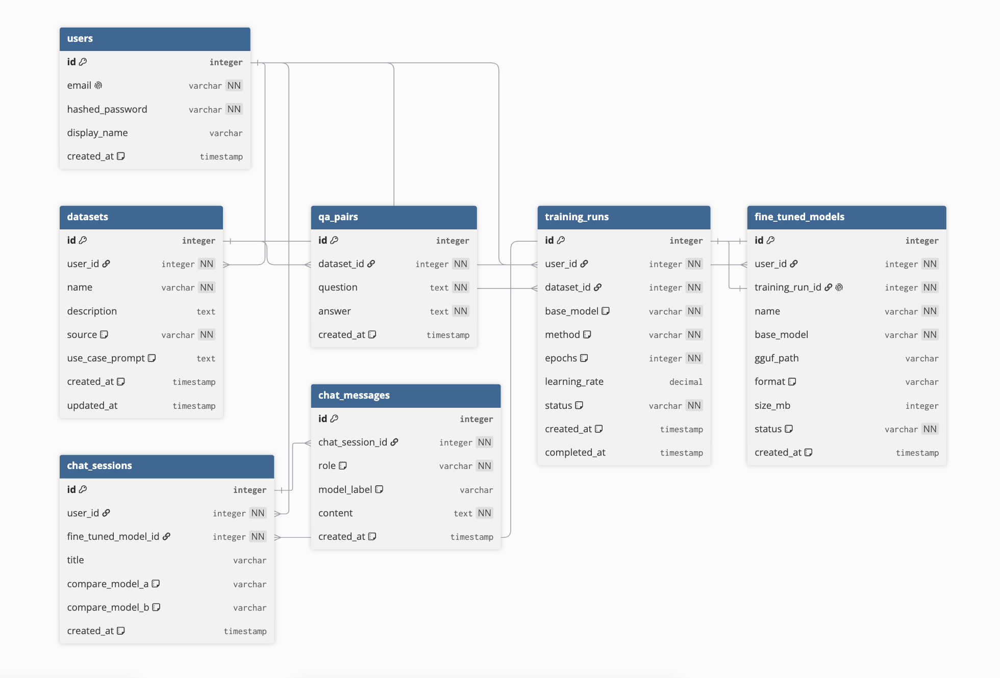

# Entity Relationship Diagram

Data model for the LLM Fine Tuner & Agent Tester app. Rendered in dbdiagram.io.

## Entities

- **User**: an account. Owns datasets, training runs, fine-tuned models, and chat sessions.
- **Dataset**: a named collection of question-answer pairs for one use case. Created manually, imported from Hugging Face, or generated from a plain-English description.
- **QAPair**: a single question-and-answer row inside a dataset.
- **TrainingRun**: one fine-tuning job. References the dataset it trains on and stores the chosen base model, method, epochs, and status.
- **FineTunedModel**: the artifact produced by a completed training run. Holds the exported file path and format, and is the model you chat with.
- **ChatSession**: a three-way compare conversation pinned to one fine-tuned model plus two comparison models.
- **ChatMessage**: a single message in a chat session. Each user prompt produces three assistant replies, one per model, tagged by model label.

## Relationships

- A User has many Datasets, TrainingRuns, FineTunedModels, and ChatSessions.
- A Dataset has many QAPairs.
- A TrainingRun belongs to one Dataset and one User.
- A FineTunedModel belongs to one TrainingRun (one-to-one) and one User.
- A ChatSession belongs to one FineTunedModel and one User, and has many ChatMessages.

Ownership: every entity a user creates carries a user_id, so authorization can restrict edit and delete to the owner only. This satisfies the per-user data ownership requirement.